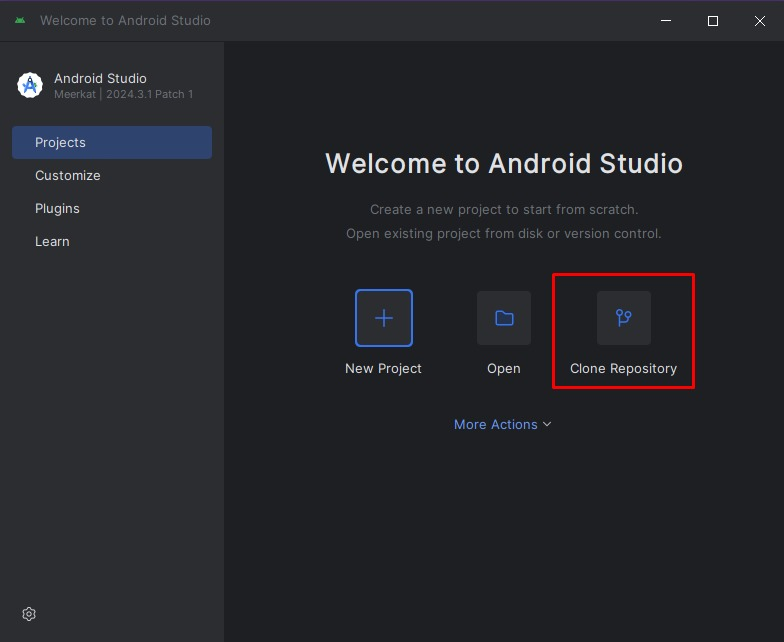

# GoodBeta
Esta repositório contém artefatos referentes a entrega do Projeto Goodbeta, como explicado no post de Revisão de Escopo 
do Forum de Discussão 2, realizado por Caio Clementino Lamarão na sexta-feira, 11 abr. 2025, às 21:48.  

* As entregas são:   
###### 
  1. SGDB - Artefatos do banco de dados do projeto Goodbeta - declarados em [./SGBD/README.md](./SGBD/README.md)
  
######  
  2. App - Artefatos do projeto inicialmente proposto - declarados em [./app/README.md](./app/README.md)

O aplicativo pode ser verificado clonando este repositório no Android Studio

##### Clonagem

| Passo 1  | Passo2 | Passo 3  | Passo 4 |
|||   |   |
|---|---|---|---|
